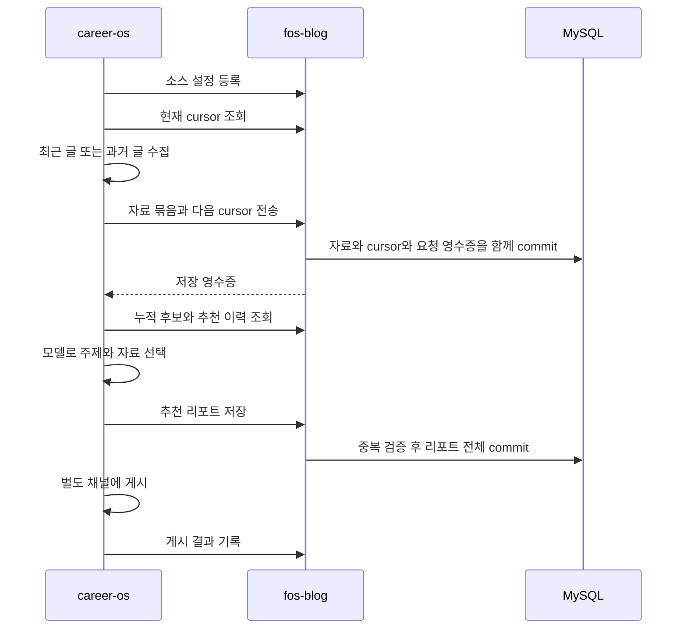

# 학습자료 HTTP 계약

**구현 범위:** 공통 관리자 인증과 소스·수집 cursor·자료 조회·개인 상태 API를 제공한다.
후속 plan064는 후보·추천·게시·가져오기 API를 이 계약대로 구현한다.
자료 API 경로와 저장 흐름은 유지하며 인증은 공통 관리자 세션을 사용한다.
GitHub 본인 계정과 Better Auth 도입이 승인되었고 서비스 Bearer 계약은 코디네이터가 확인했다.
이 문서는 career-os와 fos-blog가 공유하는 HTTP 계약의 단일 소스다.
저장 제약은 [데이터 스키마](../data-schema.md#학습자료-저장-계약)에 둔다.

## 책임과 호출 흐름

## 공통 규칙

| 항목 | 계약 |
| --- | --- |
| 기본 경로 | `/api/study/v1` |
| 전송 | HTTPS, JSON, UTF-8, 동기 응답. 큐와 스트리밍 없음 |
| 날짜 | UTC ISO 8601 문자열. 외부 원문의 `published`는 원문 문자열이며 없으면 빈 문자열 |
| 식별자 | `sourceKey`, `reportId`, `idempotencyKey`는 1~128자. ASCII 문자·숫자와 `._:-`만 허용 |
| 자료 식별자 | `contentKey`는 최대 191자. DB 정렬 규칙으로 대소문자를 합치지 않음 |
| 내부 ID | 자료의 `id`는 JSON 안전 범위 양의 정수 |
| 선택값 | 생략은 기존 값 유지 또는 명시된 기본값 적용. `null` 허용 여부는 각 필드 표를 따름 |
| 본문 제한 | 수신 원문 1 MiB 초과는 `413`. 길이는 문자열의 Unicode 문자 수로 검증 |
| 알 수 없는 필드 | 모든 쓰기 요청에서 `400 INVALID_REQUEST`로 거절 |
| 캐시 | 모든 개인 HTML·RSC·API·오류에 `Cache-Control: private, no-store`, `X-Robots-Tag: noindex, nofollow` |
| 오류 | `{error:{code,message,requestId}}`. 원문 요청, 토큰, SQL과 개인 메모를 노출하지 않음 |
| 원본 조회 | 서버는 받은 URL을 fetch하지 않음. 주소는 HTTPS만 허용하고 UI에서 일반 링크로 제공 |

| HTTP | 코드와 의미 |
| --- | --- |
| 400 | `INVALID_REQUEST`, 잘못된 키·필드·페이지 cursor |
| 401 | `UNAUTHENTICATED`, 인증 없거나 검증 실패 |
| 403 | `FORBIDDEN`, 주체 권한 부족 또는 브라우저 쓰기 Origin 불일치 |
| 404 | `NOT_FOUND`, 자료·소스·리포트 없음 |
| 405 | `INVALID_REQUEST`, 허용 메서드는 `Allow` 헤더로 제공 |
| 409 | `VERSION_CONFLICT`, `IDEMPOTENCY_CONFLICT`, `ALREADY_RECOMMENDED`, `RECENT_TOPIC_CONFLICT`, `IMPORT_CHANGED` |
| 413 | `PAYLOAD_TOO_LARGE` |
| 429 | `RATE_LIMITED`, `Retry-After` 초 제공 |
| 503 | `UNAVAILABLE`, DB·인증키 서버 장애. 빈 결과나 저장 성공으로 바꾸지 않음 |

## 인증 계약

사용자는 블로그 공통 관리자 로그인 후 공부 메뉴를 이용하는 방식을 선택했다.
Cloudflare Access와 그 전제의 `jose` 도입안은 폐기한다.
GitHub OAuth와 Better Auth를 채택한다. 설정과 검증 근거는 [관리자 인증 설정](../code-architecture.md#관리자-인증-허용-계정-판정)을 따른다.
관리자 경로와 세션 흐름은 [관리자 흐름](../flow.md#관리자-로그인과-세션)을 따른다.

| 주체 | 허용 |
| --- | --- |
| 본인 관리자 세션 | 소스 목록·자료·추천 조회, 개인 상태 수정, 가져오기 검토와 commit |
| career-os 서비스 주체 | 소스 등록·조회, 자료 수집, 후보 조회, 추천 저장과 게시 이력 기록, 가져오기 dry-run |
| 익명 또는 다른 사용자 | 개인 리소스 접근 불가 |

관리자 세션은 요청마다 DB에서 유효기간과 철회 여부, GitHub 계정의 numeric ID와 현재 환경 allowlist를 확인한다.
Better Auth의 `user.validateUserInfo`는 사용자 생성과 재로그인 시 numeric ID를 검사하고 계정연결은 거절한다.
변경 가능한 사용자명이나 검증되지 않은 이메일, 클라이언트가 보낸 `ownerId`로 권한을 부여하지 않는다.
허용 계정 한 명을 논리 소유자 `owner`에 연결하며 일반 회원가입과 계정 추가 UI는 제공하지 않는다.
브라우저 쿠키는 HttpOnly, Secure, SameSite=Lax를 사용하고 세션 토큰을 localStorage에 보관하지 않는다.
세션 테이블은 [인증 저장 계약](../data-schema.md#관리자-인증-저장-계약), endpoint는 아래 공통 관리자 인증 API 절을 따른다.

서비스는 `Authorization: Bearer <STUDY_SERVICE_TOKEN>`을 사용한다.
토큰은 최소 32바이트 난수로 생성한 서버 비밀값이며 `SYNC_API_KEY`와 별개로 발급한다.
환경 설정에 없으면 서비스 인증을 허용하지 않으며 브라우저 번들과 로그, 문서 예제에 실제 값을 넣지 않는다.
비교는 동일 길이 해시의 상수 시간 비교로 처리하며 토큰 교체 시 career-os와 서버 설정을 함께 갱신한다.
Bearer 헤더가 있으면 서비스 인증만 수행하며 실패를 세션 인증으로 우회하지 않는다.
유효한 서비스 토큰도 관리자 화면, 개인 상태 쓰기와 가져오기 commit에는 `403`으로 거절한다.
서비스 요청에는 브라우저 Origin 조건을 적용하지 않는다.

페이지와 Route Handler가 각각 검증하며 Proxy 통과만으로 인증되었다고 간주하지 않는다.
브라우저 쓰기는 설정한 사이트 Origin과 요청 `Origin`이 정확히 같아야 하며 없거나 다르면 `403`이다.
API 인증 실패는 JSON `401`로 반환하고 로그인 HTML로 리디렉션하지 않는다.
관리자 페이지의 세션 만료는 로그인 화면으로 이동하며 작성 중 메모는 저장 성공으로 표시하지 않는다.
세션과 서비스 인증 수단이 바뀌어도 아래 요청·응답 DTO와 멱등 키는 바뀌지 않는다.

## 공통 관리자 인증 API

`src/app/api/auth/[...all]/route.ts`는 `better-auth/next-js`의 `toNextJsHandler`로 연결한다.
아래 경로·메서드만 전달하고 다른 인증 endpoint는 `404`로 차단한다.
서버 컴포넌트에서 로그인·로그아웃을 실행하지 않아 `nextCookies` plugin은 필요하지 않다.
[Next.js 공식 통합 안내](https://better-auth.com/docs/integrations/next)를 따른다.

| 경로 | 메서드와 동작 |
| --- | --- |
| `/api/auth/sign-in/social` | POST. provider github만 허용, GitHub로 이동할 URL 생성 |
| `/api/auth/callback/github` | GET. OAuth state·code 검증 후 계정 검사와 세션 생성 |
| `/api/auth/get-session` | GET. DB 세션과 현재 허용 계정을 확인하고 민감한 account 필드 제외 |
| `/api/auth/sign-out` | POST. 현재 세션 철회 |

`get-session`은 익명일 때 `null`, 인증됐을 때 `user: { id, name }`과 `session: { id, expiresAt }`만 반환한다.
현재 허용 계정과 다르면 `403`, 인증 설정 부재나 DB 장애는 `503`이다.
로그아웃의 DB 삭제가 실패하면 `503`을 반환하고 쿠키를 유지해 재시도할 수 있게 한다.

GitHub OAuth App callback은 `{BETTER_AUTH_URL}/api/auth/callback/github`로 등록한다.
설정 절차는 [공식 GitHub provider](https://better-auth.com/docs/authentication/github)를 따른다.
기존 콘텐츠 동기화의 GITHUB_TOKEN과 OAuth client secret을 재사용하지 않는다.
`baseURL`과 `trustedOrigins`는 설정한 한 origin으로 고정하며 요청 Host나 forwarded header로 추론하지 않는다.
브라우저 POST는 Origin이 없거나 다르면 `403`이고 GET callback은 OAuth state 검증을 유지한다.
callback에는 일반 브라우저 POST Origin 규칙을 적용하지 않는다.
복귀 경로는 URL 파싱 뒤 같은 origin의 `/admin` 또는 `/admin/` 하위만 허용한다.
`/administrator`, 프로토콜 상대 URL, 외부 origin과 `/admin/login` 복귀는 `/admin`으로 대체한다.
오류 복귀 주소는 `/admin/login`으로 고정하고 허용한 오류 코드만 한국어 문구로 변환한다.
provider가 보낸 error_description 원문을 화면이나 로그로 전달하지 않는다.

인증 진입점과 관리자 응답에도 `private, no-store`, `noindex, nofollow`를 적용한다.
Better Auth 자체 rate limit과 OAuth state·CSRF 검사를 비활성화하지 않는다.
study API의 오류 envelope와 인증 라이브러리의 오류 응답은 별도 계약이다.

## 자료 URL 식별

career-os `scripts/study-topic-recommender/url_identity.ts`의 계약을 그대로 따른다.
확인 기준은 `origin/plan115-study-library-integration`의 `7d25915`이며 구현 시 양쪽 fixture를 대조한다.

| 입력 | 처리 |
| --- | --- |
| HTTP 등 HTTPS 외 scheme | 거절 |
| YouTube watch, youtu.be, shorts, live, embed | `https://www.youtube.com/watch?v={videoId}`와 `youtube:{videoId}` |
| 일반 HTTPS URL | fragment 제거, 대소문자 무관 `utm_*`, `fbclid`, `feature`, `gclid`, `si` 제거 |
| 일반 URL 쿼리와 경로 | `URLSearchParams.sort()` 적용, 루트 외 경로의 끝 `/` 제거 |
| 일반 URL 키 | 정규 URL UTF-8 바이트의 SHA-256 소문자 hex 앞에 `url:` 추가 |

YouTube video ID 대소문자를 유지한다.
정규화 결과가 전송한 `contentKey` 또는 `canonicalUrl`과 다르면 요청 전체를 거절한다.
일반 URL의 의미 있는 쿼리, hostname의 `www`와 경로 대소문자를 임의로 합치지 않는다.

## 소스 등록과 cursor

| 요청 | 입력 | 응답 |
| --- | --- | --- |
| `PUT /sources/{sourceKey}` | 서비스 전용. 아래 소스 필드와 `expectedVersion` | `200 {source,version}` |
| `GET /sources` | 본인 또는 서비스. query 없음 | `200 {sources:[Source...]}` |
| `GET /sources/{sourceKey}/cursor` | 서비스 전용. 필수 query `mode=recent` 또는 `mode=archive` | `200 {sourceKey,mode,cursor,version}` |

| 소스 필드 | 타입과 의미 |
| --- | --- |
| `title` | 필수 문자열 1~500자 |
| `category` | `techBlog`, `geek`, `ai`, `video` 중 하나 |
| `url`, `feedUrl` | 각각 HTTPS URL 2048자 이하 또는 `null`. 적어도 하나 필요 |
| `adapter` | `feed`, `page`, `youtube` 중 하나. feed에는 feedUrl, 나머지는 url 필수 |
| `enabled` | 필수 boolean |
| `expectedVersion` | 생성은 0, 갱신은 현재 양의 정수 |

career-os 설정의 `key`는 경로의 `sourceKey`로 변환한다.
PUT은 생성과 갱신 모두 표의 필드 전부를 필수로 받는 전체 교체이며 부분 수정이 아니다.
URL이 없는 필드는 명시적으로 null을 보내고, 갱신도 완성된 필드 조합을 검증한다.
Source는 `sourceKey,title,category,url,feedUrl,adapter,enabled,version`을 포함한다.
소스 목록은 비활성 소스까지 sourceKey 오름차순으로 반환하며 본인 UI 필터의 소스다.
cursor의 mode 생략 또는 허용값 밖의 입력은 `400 INVALID_REQUEST`다.
기존 소스 삭제 API는 제공하지 않으며 `enabled=false`로 수집을 중지한다.
미생성 cursor는 `cursor:null, version:0`을 반환한다. 소스 자체가 없으면 `404`다.
cursor는 객체 또는 `null`인 opaque JSON이며 직렬화한 UTF-8 크기는 64 KiB 이하다.
서버는 sitemap queue나 YouTube pageToken 내부 구조를 해석하지 않는다.
cursor 단독 쓰기는 제공하지 않는다.

## 자료 배치 저장

`POST /ingestions`는 아래 필드를 받는다.

| 필드 | 타입과 의미 |
| --- | --- |
| `sourceKey` | 등록된 활성 소스의 키 |
| `mode` | `recent` 또는 `archive` |
| `items` | 자료 0~100개. 같은 배치 내 contentKey 중복은 거절 |
| `cursor` | 저장 완료 후 다음에 사용할 opaque JSON 객체 또는 `null` |
| `expectedCursorVersion` | 조회한 cursor 버전. 최초 0 |
| `idempotencyKey` | 한 배치에 고정한 재시도 키 |

| 자료 필드 | 타입과 의미 |
| --- | --- |
| `contentKey`, `canonicalUrl`, `url` | 필수. url은 원래 HTTPS 주소이며 나머지는 정규화 검증 대상 |
| `title` | 필수 문자열 1~500자 |
| `published` | 원문 발행일 문자열 0~128자. 없으면 빈 문자열 |
| `publishedAt` | UTC ISO 날짜 또는 `null`. 해석 불가하면 `null`, 수집 시각으로 대체하지 않음 |
| `excerpt` | 0~2000자 문자열 또는 `null`. 제한적 발췌·요약이며 전문 저장 금지 |
| `kind` | `feed-article`, `feed-video`, `page-link`, `page-video` 중 하나 |
| `tags` | 중복 없는 문자열 배열, 최대 20개, 항목 1~50자. 없으면 빈 배열 |
| `collectedAt` | 필수 UTC ISO 날짜 |

배치 안에서 sourceName과 category를 받지 않고 등록 소스로부터 결정한다.
cursor 행을 잠그고 버전 비교 후 자료와 소스별 수집 정보, cursor와 멱등 영수증을 한 트랜잭션에 저장한다.
자료가 0개여도 정상적으로 수집한 빈 페이지라면 cursor를 진행할 수 있다.
수집 실패는 career-os에서 요청을 보내지 않아야 하며 실패를 빈 페이지로 표현하지 않는다.

성공은 `200 {idempotencyKey,acceptedCount,cursorVersion}`이다.
같은 키와 같은 본문은 원래 영수증을 반환하고 cursor 버전을 추가 증가시키지 않는다.
동일 키의 다른 본문은 `409 IDEMPOTENCY_CONFLICT`, 다른 배치의 오래된 cursor 버전은 `409 VERSION_CONFLICT`다.
JSON 키 순서를 정렬하고 배열 순서를 유지한 본문을 UTF-8 SHA-256으로 해시한다.
응답이 유실된 재시도는 버전 비교보다 영수증 조회를 먼저 한다.

여러 소스에서 같은 자료가 나와도 자료는 하나이고 소스 연결은 여러 개다.
자료 메타는 `collectedAt`이 더 최신일 때만 갱신하고 같은 시각의 다른 내용은 기존 값을 유지한다.
어느 수집도 개인 상태와 추천 당시 내용을 덮어쓰지 않는다.

## 자료와 후보 조회

| 요청 | 주체 | 응답 |
| --- | --- | --- |
| `GET /materials` | 본인 | `{items:Material[],nextCursor:string\|null}` |
| `GET /materials/{id}` | 본인 | `{material:Material}` |
| `GET /candidates` | 서비스 | `{candidates:Candidate[],recentStudyTopicKeys:string[],nextCursor:string\|null,historyVersion:number}` |

자료 단건 조회는 query 없이 전체 Material을 반환하며 없는 ID는 `404`다.
상세 패널과 상태 충돌 후 최신 state 확인은 이 단건 조회를 사용한다.
두 목록 요청은 `limit` 기본 30, 최대 100과 opaque `cursor`를 지원한다.
`materials`는 `q` 200자 이하, `sourceKey`, `category`, `kind`, `starred`, `read`, `recommended`, `publishedFrom`, `publishedTo` 필터를 조합한다.
boolean 필터는 `true` 또는 `false`만 받으며 생략하면 해당 조건을 적용하지 않는다.
`candidates`는 `sourceKey`, `category`, `kind`, `publishedFrom`, `publishedTo`를 지원하며 추천 여부로 기본 제외하지 않는다.
날짜 필터는 UTC ISO 8601 시각이며 `publishedFrom <= publishedAt < publishedTo`로 적용한다.
둘 다 지정하거나 한쪽만 지정할 수 있다.
둘 다 있을 때 시작이 끝보다 늦거나 같으면 `400 INVALID_REQUEST`다.
날짜 필터가 하나라도 있으면 발행일이 `null`인 자료는 제외하고, 없으면 포함한다.
재추천 여부는 누적 집합을 기준으로 각 후보에 `previouslyRecommended`로 제공한다.
검색은 제목과 excerpt의 부분 문자열이며 `%`, `_`, 역슬래시는 SQL LIKE 이스케이프한다.

정렬은 변경되지 않는 자료 `id DESC`이며 cursor에 마지막 ID와 최초 최대 ID, 필터 해시를 담는다.
새로 들어온 자료는 새 조회에 표시하고 진행 중 페이지에 끼워 넣지 않는다.
cursor는 권한 수단이 아니며 모든 페이지에서 인증한다. 다른 필터의 cursor는 `400`이다.
후보 첫 조회는 추천 이력 버전을 고정하고 이후 페이지에서 변경을 감지하면 `409 VERSION_CONFLICT`다.
후보를 모두 읽은 뒤 추천 저장에서도 최신 중복 조건을 다시 검사한다.

| 응답 객체 | 필드 |
| --- | --- |
| `Material` | `id,contentKey,canonicalUrl,title,publishedAt,excerpt,tags,kind,sources,state,previouslyRecommended` |
| `Material.sources[]` | `sourceKey,sourceName,category` |
| `Material.state` | `starred:boolean,read:boolean,note:string,version:number,updatedAt:string\|null` |
| `Candidate` | `id:string,contentKey,canonicalUrl,sourceKey,sourceName,category,title,url,published,excerpt,kind,previouslyRecommended` |

Candidate의 `id`는 contentKey이며 기존 candidateId 참조로 사용한다.
후보가 여러 소스에 연결되면 sourceKey 오름차순 첫 활성 소스를 사용한다. sourceKey 필터가 있으면 그 소스를 사용한다.
Candidate.excerpt는 값이 없으면 생략하여 기존 optional string 스키마에 맞춘다.
Material.excerpt는 없으면 `null`이며 state 미생성 기본값은 `false,false,"",0,null`이다.
추천 이력이 없으면 `recentStudyTopicKeys:[]`와 `historyVersion:0`이다.
최근 주제는 추천 순서상 직전 리포트의 topicKey 집합이다. 추천이 없는 최신 리포트라면 빈 집합이다.

## 개인 상태 수정

`PATCH /materials/{id}/state`는 `expectedVersion`과 `starred`, `read`, `note` 중 하나 이상을 받는다.
`starred`, `read`는 boolean이고 `note`는 0~5000자 일반 텍스트다. `null`은 받지 않는다.
요청에 없는 필드는 유지하고 note 빈 문자열은 메모 지우기다.

서버가 본인 고정 소유자에 속한 행의 버전을 비교해 성공할 때 한 번 증가시킨다.
`200 {state}`로 저장한 전체 상태를 반환한다.
오래된 버전은 `409 VERSION_CONFLICT`이며 `GET /materials/{id}`로 최신 state를 읽고 사용자가 다시 시도한다.
토글 명령 대신 원하는 최종 boolean을 보내며 응답 유실 후 같은 버전 재전송은 충돌로 처리한다.
UI는 충돌을 성공으로 표시하거나 다른 기기의 메모를 자동 덮어쓰지 않는다.

## 추천 저장과 조회

`POST /recommendation-runs`는 다음 리포트를 원자적으로 저장한다.

| 필드 | 타입과 의미 |
| --- | --- |
| `reportId` | career-os가 만든 고유 ID. 아침 리포트는 서울 날짜의 `morning-YYYY-MM-DD` |
| `generatedAt` | UTC ISO 날짜 |
| `topics` | 최대 20개. 빈 배열은 추천 없는 실행의 정상 이력 |
| `topics[].topicKey` | 최대 128자, 소문자 영문·숫자와 하이픈 구분자 |
| `topics[].title`, `careerQuestion` | 각각 1~300자 |
| `topics[].items` | 주제당 1개 이상, 전체 리포트 최대 100개 |
| `items[].contentKey` | 이미 저장된 자료 키 |
| `items[].summary`, `reason` | 각각 1~300자 |
| `items[].careerValue` | `current-work`, `target-role`, `engineering-judgment`, `product-business` |

한 리포트의 중복 topicKey나 contentKey는 `400`이다. 없는 자료는 `404`이며 부분 저장하지 않는다.
추천 조정용 단일 행을 잠그고 직전 리포트 주제와 누적 추천 집합을 다시 검사한다.
직전 주제와 겹치면 `409 RECENT_TOPIC_CONFLICT`, 추천한 자료이면 `409 ALREADY_RECOMMENDED`다.
다른 요청이 동시에 같은 자료나 같은 주제를 선택해도 하나만 commit된다.
성공은 `200 {reportId,historyVersion}`이며 같은 reportId와 본문 재시도는 원래 응답을 반환한다.
같은 reportId의 다른 본문은 `409 IDEMPOTENCY_CONFLICT`다.
`generatedAt`과 별개로 서버 commit 순서가 최근 리포트를 정한다.

`GET /recommendation-runs`는 본인에게 `{items:[{reportId,generatedAt,topicCount}],nextCursor}`를 반환한다.
페이지 크기와 cursor 규칙은 자료 조회와 같고 서버 추천 순서 내림차순이다.
`GET /recommendation-runs/{reportId}`는 `{reportId,generatedAt,topics,publications}`를 반환한다.
topic과 item은 저장 요청 필드에 item의 `materialId,title,canonicalUrl,state`를 더한다.
title과 canonicalUrl은 추천 시점 snapshot이고 state만 현재 값이다.

## 게시 이력

`POST /publications`는 `{idempotencyKey,reportId,channel,publishedAt,externalId,url}`을 받는다.
channel과 externalId는 각각 1~128자, publishedAt은 UTC ISO 날짜, url은 HTTPS 주소 또는 null이다.
reportId가 없으면 `404`이고 성공은 `200 {publicationId}`다.
같은 reportId와 channel과 externalId의 같은 기록은 같은 ID를 반환한다.
같은 키에 다른 내용은 `409 IDEMPOTENCY_CONFLICT`다.
fos-blog는 이 요청으로 외부에 게시하지 않으며 career-os가 게시 성공 후 기록한다.
게시 실패나 기록 실패가 추천 리포트를 삭제하거나 재추천 가능 상태로 되돌리지 않는다.
조회 publications 항목은 `publicationId,channel,publishedAt,externalId,url`을 포함한다.

## 기존 이력 가져오기

외부 파일·Pages를 서버가 직접 읽지 않는다. career-os가 정규화한 payload를 전송한다.
신규 추천 API와 가져오기 API는 구분하여 과거 리포트의 반복 자료를 보존한다.

| 요청 | 주체와 응답 |
| --- | --- |
| `POST /imports/dry-run` | 서비스 또는 본인. `{importKey,reports}`를 검증해 `{previewHash,historyVersion,counts,warnings}` 반환 |
| `POST /imports/commit` | 본인. 같은 payload와 `previewHash,expectedHistoryVersion`을 받아 `200 {importKey,counts,historyVersion}` 반환 |

importKey는 공통 식별자 규칙을 따르며 reports는 1~100개로 reportId 중복을 거절한다.
가져오기는 신규 추천과 구분된 `ImportReport`, `ImportTopic`, `ImportItem` 스키마를 사용한다.

| 객체 | 필드와 검증 |
| --- | --- |
| `ImportReport` | `reportId,generatedAt,topics`. topics는 최대 20개이며 빈 배열 허용 |
| `ImportTopic` | `topicKey,title,careerQuestion,items`. careerQuestion은 1~300자 또는 null |
| `ImportItem` | `contentKey,canonicalUrl,sourceKey,title,category,summary,reason,careerValue`. summary와 reason은 1~300자 또는 null, careerValue는 신규 추천 enum 또는 null |

나머지 길이·키 검증과 주제당 최소 1개, 리포트당 최대 100개 항목 제한은 신규 추천과 같다.
summary와 reason, careerValue는 옛 이력에 없으면 명시적인 `null`로 보존하며 임의 문장이나 분류를 생성하지 않는다.
category는 등록 소스와 같아야 하고 canonicalUrl을 정규화해 contentKey가 일치하는지 검사한다.
sourceKey는 미리 등록되어 있어야 하며 자료가 없으면 snapshot만으로 가져오기 전용 자료를 생성한다.
생성 자료의 url은 canonicalUrl과 같게 저장한다.
생성 자료의 excerpt와 publishedAt은 null, published는 빈 문자열, tags는 빈 배열이다.
가져오기 항목의 kind는 `canonicalUrl`이 YouTube이면 `page-video`, 나머지는 `page-link`다.

기존 reports의 `recommendedAt`은 generatedAt으로, entries의 `studyTopicKey`, `studyTopic`은 topicKey와 title로 변환한다.
careerQuestion도 없는 옛 이력에서는 `null`을 허용한다.
동일 reportId와 topicKey를 묶되 같은 리포트의 contentKey 중복은 오류다.
다른 과거 리포트의 contentKey 반복은 경고이며 이력 행을 각각 보존한다.

dry-run은 DB에 쓰지 않고 정규 payload SHA-256과 현재 이력 버전, 영향을 받을 개수를 반환한다.
counts는 `reports,items,newMaterials,repeatedContentKeys,existingReports`이며 warnings는 `{code,message}` 배열이다.
commit은 같은 검증을 다시 수행하고 previewHash와 현재 historyVersion을 확인한다.
미리보기 이후 이력이 변하면 `409 IMPORT_CHANGED`다.
importKey 재전송은 동일 본문에 한해 원래 응답을 반환하며 다르면 `409 IDEMPOTENCY_CONFLICT`다.
한 요청은 전체 트랜잭션이며 자료 생성, 이력 보존과 누적 추천 집합 갱신을 함께 수행한다.
이미 저장된 reportId는 동일 정규 내용이면 건너뛰고 다르면 충돌한다.
가져오기 안의 새 리포트는 generatedAt과 reportId 오름차순으로 삽입한다.
최신 리포트 포인터가 없거나 가져온 마지막 리포트의 `(generatedAt,reportId)`가 현재 포인터보다 클 때만 포인터를 갱신한다.
신규 추천 저장은 앞서 정의한 commit 순서로 포인터를 갱신한다.
가져오기 commit은 한 번 historyVersion을 증가시키며 건너뛴 기존 리포트의 버전은 바꾸지 않는다.
리포트 목록의 정렬은 삽입 ID 내림차순이라 최근에 가져온 과거 이력도 목록 앞에 나타날 수 있다.
리포트 조회는 가져온 null 필드를 그대로 반환하며 UI는 “기존 이력에 설명 없음”으로 표시한다.

## 소비측 호환 기준

코디네이터가 확인한 계약을 기록한 것이며 이번 작업자가 수집을 실행한 결과는 아니다.
이 문서의 서비스 Bearer 계약을 career-os가 소비한다.

| 항목 | 전달받은 조건 |
| --- | --- |
| career-os 기준 | `origin/plan115-study-library-integration`, `7d25915`. URL 식별·기존 reports/entries 호환 유지 |
| Kurly | `sitemap-index.xml` 사용. `sitemap.xml`은 403 관측 |
| Olive | `sitemap-index.xml`로 과거 자료 수집 |
| Kakao | `sitemap.xml`의 urlset에서 posts 경로 필터 |
| YouTube | 공개 channel ID에서 uploads playlist를 구하고 `playlistItems.list`의 maxResults 50과 pageToken 사용 |
| YouTube API key 부재 | archive 미지원으로 알리고 RSS 최근 수집 유지. 실패를 빈 성공 배치로 보내지 않음 |
| 소비 환경 | career-os의 `STUDY_LIBRARY_URL`과 `STUDY_SERVICE_TOKEN`. 실제 비밀값은 환경에서 주입 |
| 옛 이력 | 날짜 필터의 null 구분 유지. 누락한 careerQuestion·summary·reason·careerValue는 null 보존 |
