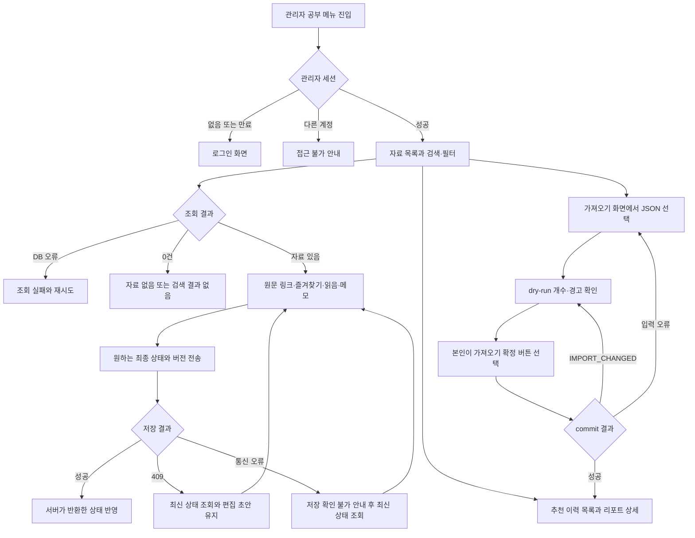
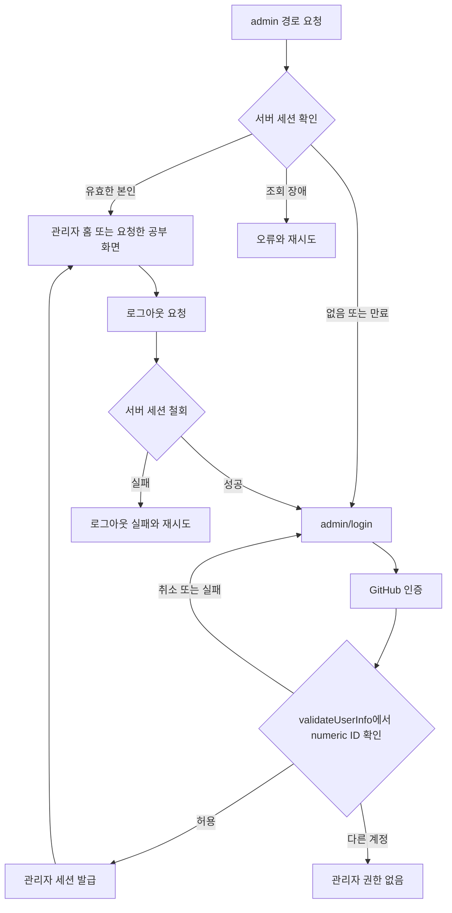

# Flow: 사용자 흐름

## 학습자료 관리 흐름

**구현 범위:** 공통 관리자 로그인과 자료 저장·소스·수집 cursor·개인 상태 API 흐름을 제공한다.
추천·가져오기 API와 관리자 공부 화면 흐름은 후속 계획이다.
GitHub 본인 계정과 Better Auth를 사용한다.
본인 전용 UI와 career-os의 수집·추천 역할을 기준으로 작성했다.
요청 스키마는 [학습자료 API](./api/study-library.md)를 따른다.



### 화면과 상태

| 경로 | 정보와 조작 | 실패·빈 상태 |
| --- | --- | --- |
| `/admin/login` | 관리자 로그인 버튼과 로그인 실패 안내 | 취소·인증 제공자 장애·허용하지 않은 계정을 구분하고 재시도 제공 |
| `/admin` | 본인 계정, 공부 메뉴, 로그아웃 | 세션 없음은 로그인 이동, 세션 조회 장애는 오류 표시 |
| `/admin/study` | 자료 제목, 소스, 발행일, 종류, 태그, 추천 여부와 개인 상태. 검색, 소스·분류·종류·날짜·즐겨찾기·읽음·추천 필터, 더 보기 | 첫 목록 없음과 검색 결과 없음 구분. DB 오류는 재시도. null 발행일은 발행일 정보 없음 |
| `/admin/study/recommendations` | 생성일과 주제 수의 추천 목록, 더 보기 | 추천 없음과 조회 실패 구분 |
| `/admin/study/recommendations/[reportId]` | 주제, 업무 질문, 추천 당시 제목·요약·이유·분류, 현재 개인 상태, 게시 기록 | 없는 리포트는 404. 과거 null 설명은 기존 이력에 설명 없음 |
| `/admin/study/imports` | 정규화 JSON 파일 선택, dry-run 결과 개수·경고, 가져오기 확정 버튼 | JSON·크기 오류는 저장하지 않음. 이력 변경 시 새 dry-run 필수 |

목록은 모바일 한 열로 표시하며 PC에서도 같은 조작 이름을 사용한다.
검색·필터는 URL query에 두고 바뀌면 cursor와 누적 목록을 초기화한다.
느린 이전 응답은 요청 식별자로 무시하고 새 필터 결과를 덮어쓰지 않는다.
날짜 입력은 한국 날짜 시작과 종료 다음 날 00:00을 UTC로 바꿔 API의 반열린 구간에 전달한다.
원문 링크는 새 탭으로 열며 자료 URL의 서버 fetch와 외부 이미지 자동 로드는 하지 않는다.

상태 저장은 자료별 한 요청만 허용하고 성공 전에는 저장 완료로 표시하지 않는다.
메모는 일반 텍스트 입력과 명시적인 저장 버튼을 사용한다.
409와 응답 유실 후에는 `GET /materials/{id}`로 최신 상태를 읽고 편집 초안을 함께 보존하며 자동 덮어쓰지 않는다.
저장 중 버튼은 비활성화하고 결과는 `aria-live`로 알린다.
조회 중 skeleton과 더 보기 버튼을 제공하고 오류 후 같은 cursor로 재시도한다.
개인 데이터는 localStorage, analytics, 광고와 공개 검색에 넣지 않는다.

가져오기는 본인이 `/admin/study/imports`에 정규화 JSON을 선택하는 명시적 경로로 제공한다.
선택 파일은 `{importKey,reports}` payload 자체이며 career-os가 별도로 저장한 dry-run 응답 파일은 받지 않는다.
브라우저는 서버가 검증한 previewHash와 historyVersion을 보관한 뒤 같은 payload로 commit한다.
사용자가 파일을 바꾸면 이전 미리보기와 확정 가능 상태를 폐기한다.
서비스 주체는 dry-run까지만 허용하며 본인의 확인 없이 commit하지 않는다.

### 관리자 로그인과 세션



로그인 뒤 복귀 주소는 같은 origin의 `/admin` 하위 경로만 허용하고 나머지는 `/admin`으로 대체한다.
`/admin/login`은 세션을 요구하지 않으며 이미 로그인한 관리자는 `/admin`으로 이동한다.
로그아웃은 서버에서 현재 세션을 철회한 뒤 쿠키를 지우며 뒤로 가기 후에도 개인 응답을 재사용하지 않는다.
상태 쓰기 API가 `401`이면 편집 중 내용을 화면에 유지하고 재로그인이 필요함을 알린다.
다른 탭에서 세션이 철회된 경우 다음 서버 요청부터 거절한다.
로그인 실패와 세션 조회 장애는 서로 구분하고 장애를 익명 정상 화면으로 바꾸지 않는다.
로그인·callback 경로는 인증 시작에 필요한 공개 진입점이지만 공부 데이터는 반환하지 않는다.
신규 생성과 기존 계정 재로그인 모두 같은 ID 검증을 통과해야 하며 계정연결 요청은 거절한다.
환경 allowlist가 바뀌면 이전 계정은 남은 세션 유효기간과 무관하게 다음 page/API 요청부터 거절한다.
세션 유효기간과 callback 오류 처리 기준은 [관리자 인증 설정](./code-architecture.md#관리자-인증-허용-계정-판정)을 따른다.
모든 관리자 화면에는 광고·방문 통계·공개 색인과 외부 자료 이미지 자동 로드를 적용하지 않는다.

### 화면 구성과 조작

관리자 메뉴는 `공부`, `추천 이력`, `이력 가져오기`와 `로그아웃`으로 구성한다.
plan062의 공부 화면 구현 전에는 세 메뉴를 비활성 버튼과 `준비 중` 텍스트로 표시하며 링크를 노출하지 않는다.
계정 표시는 읽기 전용이며 계정 추가·수정, 역할 관리와 다른 관리자 기능은 범위 밖이다.
모바일에서는 메뉴와 필터를 접을 수 있지만 현재 필터와 초기화 버튼은 보이게 유지한다.
검색은 제출 버튼으로 적용하고 자료 카드마다 원문 열기, 즐겨찾기, 읽음, 메모 저장을 제공한다.
더 보기로 추가한 자료 뒤로 키보드 초점을 임의 이동하지 않으며 추가 개수를 알린다.
리포트 제목과 가져오기 경고는 일반 텍스트로 표시하고 원문 HTML이나 Markdown으로 실행하지 않는다.

### 수집기 운영 경계

career-os가 소스 등록, 최근·과거 수집과 모델 선택을 실행하고 fos-blog API를 소비한다.
정상 빈 페이지와 수집 실패를 구분하고 성공 배치에만 다음 cursor를 묶어 저장한다.
게시 실패는 이미 저장한 추천을 취소하지 않으며 재전송은 동일 reportId를 사용한다.
확인된 과거 수집 경로와 API key 부재 시 대응은
[소비측 호환 기준](./api/study-library.md#소비측-호환-기준)에 남긴다.

**작성일:** 2026-04-19
**관련:** [prd.md](./prd.md)

---

## 주요 흐름 1: 홈 → 최신 글 연속 탐색

```
[홈페이지 /]
  │
  ├─ "최근 글" 섹션 (6개 SSR 렌더)
  │    ├─ 첫 글: 전체 폭 대표 카드
  │    └─ 나머지 글: 썸네일 중심 카드 배열
  │    │
  │    └─ 섹션 하단 CTA 버튼 "최신 글 더 보기 →" 클릭
  │         │
  │         ▼
  │    [/posts/latest]
  │         │
  │         ├─ SSR: 최신 10개를 썸네일 중심 카드 배열로 렌더
  │         │       (updatedAt DESC, id DESC)
  │         │
  │         ├─ 스크롤 바닥 근처 도달 (IntersectionObserver 트리거)
  │         │    │
  │         │    ├─ 카드형 스켈레톤 3개 노출
  │         │    │
  │         │    ├─ GET /api/posts/latest?limit=10&cursor=<iso>:<id>
  │         │    │    │
  │         │    │    ├─ 성공: items 10개 append, nextCursor 갱신
  │         │    │    │
  │         │    │    └─ 실패: 스켈레톤 제거 + 인라인 "재시도" 버튼
  │         │    │         └─ 클릭 시 동일 cursor로 재요청
  │         │    │
  │         │    └─ 반복 (nextCursor === null 까지)
  │         │
  │         ├─ 수동 "더 보기" 버튼 (IntersectionObserver와 병행, 키보드 대응)
  │         │
  │         ├─ 스크롤 > 300px: 플로팅 "맨 위로" 버튼 노출
  │         │
  │         └─ 끝 도달 (nextCursor === null):
  │              "더 이상 글이 없습니다." + "맨 위로" 버튼
  │
  └─ PostCard 클릭 → /posts/<path>
       └─ 뒤로가기 → /posts/latest 재진입 (첫 SSR 10개로 리셋, 스크롤 위치만 브라우저 기본 복원 시도)
```

---

## 주요 흐름 2: 홈 → 인기 글 연속 탐색

```
[홈페이지 /]
  │
  ├─ "인기 글" 섹션 (6개 SSR 렌더, visitStats 존재 시만 노출)
  │    │
  │    └─ 섹션 하단 CTA 버튼 "인기 글 더 보기 →" 클릭
  │         │
  │         ▼
  │    [/posts/popular]
  │         │
  │         ├─ SSR: 인기 10개 렌더 (visitCount DESC, pagePath ASC)
  │         │       — visitStats에 행이 있는 글만
  │         │
  │         ├─ 스크롤 바닥 근처 도달
  │         │    │
  │         │    ├─ GET /api/posts/popular?limit=10&offset=10
  │         │    │    │
  │         │    │    ├─ 성공: items 10개 append, hasMore 갱신
  │         │    │    │
  │         │    │    └─ 실패: 인라인 "재시도" 버튼 (동일 offset)
  │         │    │
  │         │    └─ 반복 (hasMore === false 까지)
  │         │
  │         └─ 끝 도달 (hasMore === false):
  │              "더 이상 글이 없습니다." + "맨 위로" 버튼
  │              ※ visitStats에 없는 글은 이 목록에 표시되지 않음 — 정상 동작
```

---

## 주요 흐름 3: 홈/네비 → 시리즈 발견 (plan047)

```
[Header navigation "03 / 시리즈"]   또는   [메인 페이지 "시리즈" 섹션]
              │                                    │
              └──────────────┬─────────────────────┘
                             ▼
                       [/series 인덱스]
                       (latestUpdatedAt DESC 정렬, 카드 grid)
                             │
                             ├─ SeriesCard 클릭 → [/series/<name>]
                             │       │
                             │       └─ 시리즈 글 목록 (seriesOrder ASC)
                             │              │
                             │              └─ PostCard 클릭 → /posts/<path>
                             │
                             └─ 시리즈 0건: "아직 등록된 시리즈가 없습니다" 빈 상태
```

진입점:

- 전역 (모든 페이지): Header `navLinks` "03 / 시리즈"
- 메인 페이지: "인기 글" 과 "최근 글" 사이 "시리즈" 섹션 (최근 업데이트 4개)와 "시리즈 더 보기" CTA
- 글 상세 (기존, plan033): `ArticleHero` / `ArticleFooter` 의 series 링크 → `/series/<name>`

---

## 글 목록의 공통 동작

최신·인기 목록은 [PostsInfiniteList](../src/components/PostsInfiniteList.tsx)의 상태 처리를 공유한다.
첫 목록은 서버에서 표시하고 추가 조회는 스크롤 감지 또는 키보드로 누를 수 있는 “더 보기” 버튼으로 실행한다.
로딩 중에는 카드 변형에 맞는 스켈레톤 세 개와 접근성 안내를 표시한다.
추가 요청 실패는 기존 목록을 유지한 채 같은 cursor 또는 offset으로 재시도할 수 있게 한다.

추가 조회할 항목이 없는 최초 빈 목록과 최초 조회 실패, 추가 조회 종료는 모두 “더 이상 글이 없습니다.”와 “맨 위로” 버튼을 표시한다.
인기 경로에 대응하는 활성 글이 없어 화면이 비어도 다음 경로가 남아 있으면 조회를 계속할 수 있다.
최초 조회 실패에는 추가 요청용 재시도 버튼이 나타나지 않는다.
스크롤이 300px를 넘으면 떠 있는 “맨 위로” 버튼도 표시한다.

## 엣지 케이스

| 상황                                     | 처리                                                                                                              |
| ---------------------------------------- | ----------------------------------------------------------------------------------------------------------------- |
| DB 연결 실패 (SSR)                       | 최신·인기 목록은 공통 종료 안내를 표시한다. 홈은 Hero와 최근 글의 빈 상태 안내를 유지한다. 최초 실패에는 추가 조회 재시도가 표시되지 않는다 |
| 추가 fetch 네트워크 실패                 | 인라인 "재시도" 버튼, 같은 cursor/offset 재시도                                                                   |
| JS 비활성화                              | SSR 10개는 보임, 추가 로드 불가 (graceful degradation)                                                            |
| 키보드만 사용                            | 수동 "더 보기" 버튼으로 동일 동작 (focus ring 유지)                                                               |
| 스크린리더                               | `aria-live="polite"` 로 새 글 추가 알림                                                                           |
| 인기 글 데이터 매우 적음 (예: 3개)       | 끝 도달 UX 그대로 — "더 이상 글이 없습니다."                                                                      |
| 무한 스크롤 중 DB sync 발생 | 최신 cursor는 앞에 추가된 새 글 때문에 offset이 밀리는 문제를 피한다. `updatedAt` 변경이나 과거 날짜의 글 추가까지 조회 결과를 고정하지는 않는다. 인기 offset은 경계 중복·누락이 가능하다 |

---

## 글 카드 대표 이미지 선택 (plan056)

```text
PostCard 렌더
  → posts.thumbnail_url 있음
      → 전용 이미지 표시
      → 로드 실패 시 카테고리별 생성 이미지
  → posts.thumbnail_url 없음
      → 카테고리별 생성 이미지
  → 카테고리별 생성 이미지도 실패
      → /og-default.png
```

- `fos-study` 동기화는 마크다운 파일 기준 상대 `thumbnail` 경로를 GitHub raw 절대 URL로 바꿔 저장한다.
- 카테고리별 대체 이미지는 AI 호출 없이 `ImageResponse`로 생성하고 장기 캐시한다.
- 글 전용 이미지가 없는 것은 정상 상태이며 동기화 실패로 기록하지 않는다.

## 썸네일 중심 목록 표시 (plan057)

```text
목록 유형 판정
  → 홈 최근 글의 첫 항목
      → featured 카드
      → 이미지 위에 어두운 덮개와 최대 세 줄 제목
  → 홈 최근 글의 나머지·최신·카테고리·태그·시리즈·관련 글
      → grid 카드
      → 16:9 이미지 아래에 분류·날짜·최대 두 줄 제목
  → 홈 인기 글·인기 글 전용 페이지
      → row 카드
      → 조회수 비교에 적합한 행 목록 유지
```

- 일반 카드의 소개글은 숨기고 제목을 이미지 밖에 둔다.
- 일반 카드는 모바일 1열, 태블릿 2열, 넓은 화면 3열로 배치한다.
- 최신 글 추가 조회 결과는 기존 배열에 같은 카드 변형으로 추가한다.
- 이미지가 실패해도 제목과 링크는 유지되며 plan056의 대체 이미지 순서를 따른다.
- 빈 목록, 추가 조회 실패, 중복 요청 방지는 기존 흐름을 바꾸지 않는다.

---

## 글 요약 텍스트 (plan058)

요약을 만드는 규칙은 ADR-034가 소유한다.
여기서는 그 값이 어디에 노출되고 어느 경로로 오는지만 남긴다.

| 노출 위치 | 값의 출처 |
| --- | --- |
| 글 상세 상단 소개글, 검색엔진 설명, 공유 미리보기, 구조화 데이터 | 요청 시점에 본문에서 계산 |
| 인기 글 행 목록 카드, 시리즈 카드, 검색 대화상자 결과 | `posts.description` 저장 값 |
| RSS 항목 설명 | `posts.description` 저장 값을 300자로 자름 |

- 썸네일 중심 격자 카드는 plan057 결정에 따라 소개글을 표시하지 않는다.
- 저장 값은 동기화 때 파생 필드 보정 단계가 저장된 본문에서 다시 계산해 맞춘다.
  파일 `sha`가 그대로여도 보정이 돌기 때문에, 추출 규칙만 바뀐 경우에도 값이 따라온다.
- 산문 문단이 없는 문서는 요약이 빈 값이 되며, 이때 각 화면은 소개글 영역을 그리지 않는다.

---

## 정적 / 보조 라우트

AdSense 승인 요건(ADR-014)과 태그 탐색(ADR-023) 페이지.

| 라우트 | 진입 경로 | 설명 |
|---|---|---|
| `/contact` | Footer 링크 / 직접 접근 | 이메일과 GitHub Issues 채널 안내. 정적 렌더 |
| `/privacy` | Footer 링크 / 직접 접근 | 개인정보처리방침 (방문 통계 SHA-256 해시 / 댓글 bcrypt / Google AdSense 쿠키). ISR 24h |
| `/tag/[name]` | 글 상세 `ArticleFooter`의 태그 칩 | `decodeURIComponent(name)` → `getPostsByTag` limit=50. total=0 이면 `notFound()`. ISR 5분 (ADR-023) |
| `/series` | Header "03 / 시리즈" / 메인 시리즈 섹션 CTA | `getAllSeries()` → SeriesCard grid. 0건이면 빈 상태 메시지. ISR 5분 (plan047) |

---

## 홈페이지 변경 포인트

기존 `src/app/(blog)/page.tsx`:

- "최근 글" 섹션 헤더 우측: "모두 보기" 링크 **없음** → 섹션 **하단** CTA 버튼 신규 추가
- "인기 글" 섹션 헤더 우측: "모두 보기" 링크 **없음** → 섹션 **하단** CTA 버튼 신규 추가
- (카테고리 섹션의 "모두 보기 →" 링크 패턴은 유지, 동일한 패턴을 쓰지 않는 이유는 ADR-003 참조)

---

## 용어집 탐색 흐름 (plan054)

```text
[글 본문 또는 카테고리 README]
  │
  ├─ 개념별 첫 등장 용어에 점선 밑줄 표시
  │    ├─ desktop: hover 또는 focus
  │    └─ mobile: tap
  │          ▼
  │      [설명 툴팁]
  │          ├─ fullName + summary
  │          ├─ ESC / 바깥 클릭 / 다른 용어 열기 → 닫힘
  │          └─ "용어집에서 보기" → /glossary#<id>
  │
  └─ 일반 텍스트와 제외 영역은 변환하지 않음

[SiteFooter Glossary] → [/glossary]
  │
  ├─ 용어·전체 이름·별칭·요약 검색
  ├─ 가나다·알파벳순 용어 항목 탐색
  └─ 각 항목
       ├─ summary + Markdown description + references
       └─ 언급된 페이지 최근 5개
            └─ 더 있으면 같은 자리에서 펼침
```

### 용어집 엣지 케이스

| 상황 | 처리 |
|---|---|
| 용어집이 비어 있음 | 안내 빈 상태를 표시한다. |
| 검색 결과가 없음 | 검색어를 유지하고 결과 없음 안내를 표시한다. |
| JavaScript 비활성화 | 용어 텍스트와 기본 `title` 설명을 유지하고 `/glossary` 전체 목록은 서버 렌더링한다. |
| `glossary.json` 검증 실패 또는 누락 | 기존 용어와 역참조를 보존하고 sync를 실패 처리한다. |
| 용어 전체 삭제 | 파일 삭제 대신 유효한 `"terms": []`를 동기화한다. |
